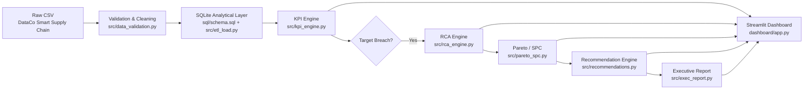

# 📦 Supply Chain Operations Control Tower
### KPI Monitoring · Automated Root-Cause Analysis · Executive Decision Support

A production-style analytics case study built to demonstrate the operations-analyst
skill set required for e-commerce supply-chain roles (Fulfillment Centers, City
Logistics, Grocery): live KPI monitoring, automated Root Cause Analysis (RCA),
Pareto / SPC process-control thinking, and executive reporting.

> **Disclaimer:** This is an independent portfolio project built on a public dataset.
> It is **not affiliated with, endorsed by, or built using data from Flipkart** or any
> employer. It is designed to demonstrate the analytical methodology used in
> supply-chain operations roles generally.

---

## 1. Business Problem

E-commerce fulfillment networks are judged on a small set of hard KPIs — on-time
delivery, SLA adherence, cost, and cancellation rate — but a KPI number alone
doesn't tell an Ops Manager *what to do*. The real job is:

1. Detect when a KPI breaches its target.
2. Find out **why**, fast, using the operational dimensions you actually control
   (region, shipping mode, category, carrier).
3. Distinguish a real signal from normal process noise (SPC).
4. Turn the finding into a prioritized, ownable corrective action.
5. Communicate all of this concisely to stakeholders.

This repository implements that full loop end-to-end, in code, on real order-level
e-commerce data — not a static dashboard of pre-computed numbers.

---

## 2. Architecture



**Design choices (and why):**
- **SQLite** over Postgres/MySQL: zero-install, single-file, fully reproducible for
  a reviewer running this locally; the analytical SQL is standard and portable.
- **One wide fact table** (`fact_order_items`) rather than a normalized star schema:
  the source data has no separate dimension keys to normalize against, and OLAP
  queries on ~180K rows are fast either way — normalizing here would add complexity
  without a real analytical benefit.
- **Rule-based recommendation engine**, not ML: corrective-action logic needs to be
  auditable and editable by an ops analyst, the same way a real RCA/CAPA log works.

---

## 3. Dataset

**DataCo Smart Supply Chain for Big Data Analysis**
(Constante, Silva & Pereira, 2019 — Mendeley Data, DOI: `10.17632/8gx2fvg2k6`)

- 180,519 order-item rows, 53 raw columns, spanning **Jan 2015 – Jan 2018**
- Order-item grain: one row per product line within an order
- Fields used: dates, delivery status, shipping mode, region/market, customer
  segment, product category, order status, sales/profit figures

### Data acquisition

This dataset is normally distributed via Kaggle, which requires an authenticated
account and is not reachable from an automated/offline pipeline. This repository
therefore documents two supported acquisition paths:

**Option A — Kaggle (recommended for a "real" local run):**
```bash
# requires a free Kaggle account + API token (~/.kaggle/kaggle.json)
kaggle datasets download -d shashwatwork/dataco-smart-supply-chain-for-big-dataanalysis
unzip dataco-smart-supply-chain-for-big-dataanalysis.zip -d data/raw/
# ensure the file is at: data/raw/DataCoSupplyChainDataset.csv
```

**Option B — what this repository actually uses:** the identical dataset re-hosted
as a plain CSV in a public GitHub repository (verified byte-identical column
schema, 180,519 rows), fetched directly:
```bash
curl -L -o data/raw/DataCoSupplyChainDataset.csv \
  https://raw.githubusercontent.com/devkoustavdas/supply-chain-and-sales-analysis/main/DataCoSupplyChainDataset.csv
```
This is the **real, full-size public dataset** — not a synthetic sample. The
pipeline (`src/data_validation.py`) validates its schema on load and will raise a
clear error (not a silent fallback) if the expected file/columns are missing, so
you always know whether you're looking at real data.

There is deliberately **no synthetic-data fallback** in this repo: the instructions
for this project explicitly prohibit silently inventing data, and the real dataset
is reliably obtainable via the method above.

---

## 4. KPIs Implemented

Only KPIs the dataset genuinely supports were implemented (see `config/config.yaml`
for the full list of **assumed** targets — the dataset carries no official SLA
charter, so targets are declared explicitly rather than invented and hidden):

| KPI | Definition | Assumed Target |
|---|---|---|
| Order Volume | order-items & distinct orders per period | — |
| On-Time Delivery % | 1 − `Late_delivery_risk`, order-item basis | ≥ 85% |
| Late Delivery % | `Late_delivery_risk` = 1 | ≤ 15% |
| SLA Adherence % | same basis as On-Time Delivery | ≥ 85% |
| Avg Shipping Days | mean(`Days for shipping (real)`) | ≤ 3.5 days |
| Cancelled / Fraud % | `Order Status` ∈ {CANCELED, SUSPECTED_FRAUD} | ≤ 3% |
| Profit Margin % | `Order Profit Per Order` / `Sales per customer` | ≥ 10% |

**Explicitly NOT computed** (and why): warehouse picking time, dock-to-stock time,
inventory turns, FC labor productivity — the dataset has **no warehouse-operations
timestamps**, only order → ship → deliver level data. Inventing these would violate
the project's core constraint against fabricated metrics.

---

## 5. RCA Methodology

When a KPI breaches target, `src/rca_engine.py` runs a five-step investigation:

1. **Baseline vs current period comparison** — trailing 3 complete months vs the
   most recent complete month (both counts and window length are configurable).
2. **Segment-level contribution analysis** across 6 real dimensions (region, market,
   shipping mode, category, customer segment, order status):
   `excess = current_late_count − (segment's own baseline rate × current volume)`.
   This isolates a **rate** effect (the segment's own performance got worse) from a
   pure **volume/mix** effect (the segment just got more orders).
3. **Pareto ranking** of contributions (80/20 view).
4. **Two-proportion z-test** per segment (α = 0.05) — flags whether a rate shift is
   statistically distinguishable from noise. This is an **association test**, not
   a causal proof.
5. **Hierarchical drill-down** — the top contributing segment is drilled into with a
   second dimension (e.g., within the worst region, which shipping mode dominates).

Every finding is phrased as a **"primary contributor"** or **"candidate operational
driver"** — never as a proven root cause, since order-item observational data alone
cannot establish causality without a designed experiment or intervention data.

---

## 6. Lean / Process-Improvement Tooling

- **Pareto Analysis** (`src/pareto_spc.py`) — all-time contribution ranking by
  dimension, with the classic 80/20 cutoff line.
- **SPC p-chart** — weekly late-delivery rate plotted against ±3σ control limits
  fit from an early baseline window, separating common-cause noise from
  special-cause signals.
- **5-Whys template** (`src/exec_report.py::five_whys_template`) — auto-populated
  with the top statistical finding; the causal "whys" are intentionally left for
  an ops analyst to fill in with ground-truth process knowledge.
- **Corrective-action engine** (`src/recommendations.py`) — transparent rule-based
  mapping from RCA dimension → owning function → recommended investigation,
  prioritized by contribution size + statistical significance.

---

## 7. Executive Reporting

`src/exec_report.py` generates a Markdown **Ops Review** (`reports/ops_review_<period>.md`)
containing: KPI status table, largest deviation, top RCA findings, Pareto
concentration, SPC stability read, prioritized corrective actions, a 5-Whys
starter, and explicit risk/data-quality watch items. Regenerate with:
```bash
python -m src.exec_report
```

---

## 8. Dashboard

`dashboard/app.py` (Streamlit) — 7 tabs:

1. **Executive Overview** — KPI scorecards, trend, top RCA finding
2. **KPI Monitor** — monthly/weekly KPI trends + full breach log
3. **SLA / RCA Investigation** — interactive baseline/current selection, dimension
   drill-down, hierarchical drill-down
4. **Pareto Analysis** — 80/20 concentration chart by any dimension
5. **Trends & SPC** — weekly p-chart with control limits
6. **Operational Recommendations** — prioritized, rule-based action list + 5-Whys
7. **Data Quality / Methodology** — data-quality report, known dataset artifacts,
   full methodology & assumptions

---

## 9. Installation

```bash
git clone <this-repo>
cd scc-control-tower
python -m venv .venv && source .venv/bin/activate     # optional but recommended
pip install -r requirements.txt

# get the data (Option A or B from Section 3 above), then:
python -m src.run_pipeline        # validate -> clean -> load -> KPI -> RCA -> report
streamlit run dashboard/app.py    # launch the interactive dashboard
```

Run tests:
```bash
pytest tests/ -v
```

---

## 10. Usage

| Task | Command |
|---|---|
| Full pipeline (build DB, KPIs, RCA, report) | `python -m src.run_pipeline` |
| Validate/clean data only | `python -m src.data_validation` |
| Rebuild SQLite DB | `python -m src.etl_load` |
| KPI table + breach list | `python -m src.kpi_engine` |
| RCA investigation | `python -m src.rca_engine` |
| Pareto + SPC | `python -m src.pareto_spc` |
| Recommendations | `python -m src.recommendations` |
| Executive report | `python -m src.exec_report` |
| Dashboard | `streamlit run dashboard/app.py` |

---

## 11. Example Findings (from an actual pipeline run on this data)

These are real, measured outputs from `python -m src.run_pipeline` on the full
180,519-row dataset — see `reports/ops_review_2017-09.md` for the full generated
report.

- **Late-delivery rate is chronically above target every single month** in the
  dataset (44–57% vs. an assumed 15% target), including the latest complete
  period, 2017-09 (**54.23%**). This is a **structural**, not episodic, SLA gap.
- Comparing 2017-09 against the trailing 3-month baseline (2017-06 to 2017-08),
  the overall rate **improved slightly** (54.94% → 54.23%, **-0.71 pp**) — i.e. no
  material recent deterioration; the story here is chronic underperformance, not
  a spike.
- By **shipping mode**, `Same Day` showed a **statistically significant** rate
  increase (51.87% → 59.93% baseline vs current, p < 0.05) and is the top-priority
  investigation target.
- Pareto analysis by region shows **no dominant single region** — the top region
  (Central America) accounts for only ~15.7% of total late orders, and it takes
  11 of 15 regions to reach 80% of late volume. This **fails the classic 80/20
  pattern**, which is itself an important finding: it points toward a
  **systemic/network-wide process issue** (e.g., a shared carrier SLA problem or a
  scheduling-estimate mis-calibration) rather than a localized regional fix.
- SPC analysis: **16 of 162 weeks** fell outside 3σ control limits — most weeks are
  "in control" around a ~54% center line, reinforcing that the core issue is the
  process's *chronic level*, not intermittent special-cause spikes.
- Data-quality check: the trailing 4 months of the source file (2017-10 → 2018-01)
  show an order-item-to-order ratio collapse (~1.0 vs ~3.0 normally) — a known
  public-dataset export-truncation artifact. These periods are **automatically
  excluded** from RCA/trend analysis to avoid a false "improvement" signal.

---

## 12. Limitations

- **No official SLA targets exist in the data** — all KPI targets in
  `config/config.yaml` are declared assumptions, clearly labeled as such
  throughout the README, dashboard, and reports.
- **Observational data only** — RCA findings are statistical associations
  (contribution + significance), not proven causal root causes. A real
  investigation would need process/system logs, not just order outcomes.
- **No warehouse-operations data** — picking time, dock-to-stock, and similar
  FC-floor metrics genuinely cannot be computed from this dataset and are not
  fabricated.
- **Truncated data tail** (2017-10 → 2018-01) is excluded from trend/RCA analysis
  rather than imputed, to avoid manufacturing false signals from incomplete data.
- Dates only run through Jan 2018 — this is historical data, not a live feed;
  the pipeline is architected to run identically against a live warehouse table.

## 13. Future Improvements

- Swap SQLite for a warehouse (BigQuery/Snowflake) + Airflow/dbt for a
  production-scale, incrementally-updating version of the same architecture.
- Add a causal-inference layer (e.g., difference-in-differences around known
  carrier or policy changes) to move from "candidate driver" to defensible causal
  claims where the right natural experiments exist in the data.
- Real-time SLA breach alerting (Slack/email webhook) triggered directly off the
  breach-detection layer in `src/kpi_engine.py`.
- Extend the recommendation engine with a lightweight cost/impact estimate per
  action to support explicit prioritization trade-offs.

---

## 14. Repository Structure

```
scc-control-tower/
├── config/config.yaml           # all targets, thresholds, assumptions (documented)
├── data/raw/                    # raw CSV (gitignored; see Section 3 to obtain)
├── data/processed/               # built SQLite DB + data-quality report (gitignored)
├── sql/schema.sql                # analytical schema
├── sql/analytical_queries.sql    # reference SQL (KPI, Pareto, SPC queries)
├── src/
│   ├── common.py                 # logging + config helpers
│   ├── data_validation.py        # schema validation + cleaning
│   ├── etl_load.py               # CSV -> SQLite loader
│   ├── kpi_engine.py             # KPI computation + breach detection
│   ├── rca_engine.py             # RCA: contribution analysis, significance, drilldown
│   ├── pareto_spc.py             # Pareto ranking + SPC p-chart
│   ├── recommendations.py        # rule-based corrective-action engine
│   ├── exec_report.py            # executive Markdown report generator
│   └── run_pipeline.py           # orchestrates the full pipeline
├── dashboard/app.py               # Streamlit application (7 tabs)
├── tests/                          # pytest suite for KPI + RCA logic
├── reports/                        # generated Ops Review reports (gitignored)
└── docs/
    ├── interview_guide.md          # interview prep for this project
    └── resume_bullets.md            # measured-metric resume bullets
```
