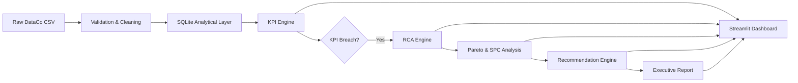

# 📦 Supply Chain Operations Control Tower

### KPI Monitoring · Automated Root-Cause Analysis · Executive Decision Support

An end-to-end supply-chain analytics system for monitoring operational KPIs, detecting SLA performance issues, performing automated Root Cause Analysis (RCA), applying Pareto/SPC process-control techniques, and generating executive-ready operational insights.

The project operates on **180,519 real order-item records** from the public DataCo Smart Supply Chain dataset and implements the complete workflow:

**Monitor → Detect → Diagnose → Prioritize → Recommend → Report**

> **Disclaimer:** This is an independent portfolio project built on a public dataset. It is not affiliated with, endorsed by, or built using proprietary data from Flipkart or any employer.

---

## 🎯 Business Problem

E-commerce supply-chain operations are monitored through KPIs such as on-time delivery, SLA adherence, shipping time, cancellations, and profitability.

A KPI dashboard alone, however, does not answer the most important operational question:

> **Why did performance change, and where should an operations manager investigate first?**

This project builds a decision-support system that:

1. Monitors operational KPIs.
2. Detects KPI breaches and abnormal performance.
3. Compares current performance against historical baselines.
4. Identifies segments contributing most to deterioration.
5. Tests whether observed changes are statistically significant.
6. Applies Pareto and Statistical Process Control analysis.
7. Prioritizes candidate operational issues.
8. Generates corrective-action recommendations.
9. Produces an executive operations review.

The objective is not simply visualization, but turning operational data into an actionable management workflow.

---

## 🏗️ Architecture



### Main components

| Component | Purpose |
|---|---|
| Data Validation | Schema validation, cleaning and data-quality checks |
| SQLite Layer | Reproducible analytical storage |
| KPI Engine | Computes operational performance metrics |
| Breach Detection | Compares KPIs against configurable targets |
| RCA Engine | Baseline comparison, contribution analysis and significance testing |
| Pareto Analysis | Identifies concentration of operational failures |
| SPC Engine | Detects statistically unusual process behavior |
| Recommendation Engine | Maps findings to transparent corrective-action suggestions |
| Executive Reporting | Generates concise operations-review reports |
| Streamlit Dashboard | Interactive KPI/RCA investigation interface |

---

## 📊 Dataset

### DataCo Smart Supply Chain for Big Data Analysis

Public supply-chain dataset containing:

- **180,519 order-item records**
- **53 original columns**
- Data spanning approximately **2015–2018**
- Shipping and delivery information
- Geographic markets and regions
- Customer segments
- Product categories
- Order status
- Sales and profit information

The analysis is performed at order-item level.

### Data acquisition

The dataset is not committed to this repository because of its size.

#### Option 1 — Kaggle

```bash
kaggle datasets download -d shashwatwork/dataco-smart-supply-chain-for-big-dataanalysis

unzip dataco-smart-supply-chain-for-big-dataanalysis.zip -d data/raw/
```

Place the CSV at:

```text
data/raw/DataCoSupplyChainDataset.csv
```

#### Option 2 — Public CSV mirror

```bash
curl -L -o data/raw/DataCoSupplyChainDataset.csv \
https://raw.githubusercontent.com/devkoustavdas/supply-chain-and-sales-analysis/main/DataCoSupplyChainDataset.csv
```

The pipeline validates the expected schema before analysis.

There is deliberately **no silent synthetic-data fallback**.

---

# 📈 KPIs Implemented

Only metrics supported by the available dataset are calculated.

| KPI | Definition |
|---|---|
| Order Volume | Number of order-items / distinct orders |
| On-Time Delivery % | Share of records without late-delivery risk |
| Late Delivery % | Share of records marked late |
| SLA Adherence % | Delivery performance against analytical target |
| Average Shipping Days | Mean actual shipping duration |
| Cancelled/Fraud % | Orders marked canceled or suspected fraud |
| Profit Margin % | Order profit relative to sales |

KPI targets are stored in:

```text
config/config.yaml
```

Because the public dataset contains no official company SLA targets, these thresholds are explicitly treated as **analytical assumptions**.

Metrics such as warehouse picking time, dock-to-stock time and FC labor productivity are intentionally not calculated because the dataset does not contain the necessary warehouse-event timestamps.

---

# 🔍 Root Cause Analysis Engine

The RCA engine is the core of the project.

When operational performance changes, the system performs a multi-stage investigation.

### 1. Baseline comparison

The latest complete month is compared with a trailing historical baseline.

Example:

```text
Current late-delivery rate
vs
Trailing 3-month late-delivery rate
```

---

### 2. Segment contribution analysis

Performance is decomposed across operational dimensions including:

- Region
- Market
- Shipping mode
- Product category
- Customer segment
- Order status

For each segment, the system estimates excess failures relative to that segment's historical baseline.

Conceptually:

```text
Excess failures
=
Current late orders
-
Expected late orders at historical segment rate
```

This separates:

**rate deterioration**

from

**simple volume/mix changes**.

---

### 3. Statistical significance

A two-proportion z-test is used to determine whether observed rate changes are statistically distinguishable from normal variation.

The project deliberately treats these as **associations**, not proof of causality.

---

### 4. Hierarchical drill-down

The highest-contributing segment can be investigated using a second operational dimension.

For example:

```text
Shipping Mode
      ↓
Same Day
      ↓
Region
      ↓
Highest-contributing region
```

This creates a structured investigation path instead of simply displaying charts.

---

# 📊 Pareto Analysis

The system performs Pareto analysis to determine whether failures are concentrated in a small number of operational segments.


An important result from the dataset is that late deliveries **do not exhibit a classic 80/20 regional concentration**.

The largest region contributes only approximately **15.7%** of late orders, and **11 of 15 regions** are required to account for 80% of late volume.

This suggests the observed delivery-performance problem is relatively distributed across the network rather than being dominated by one geographic region.

---

# 📉 Statistical Process Control

Weekly late-delivery rates are analyzed using an SPC p-chart.

The system estimates:

- process center line
- upper control limit
- lower control limit
- special-cause violations

In the analyzed period:

> **16 of 162 weeks fell outside the 3σ control limits.**

Most weeks remain statistically centered around a high late-delivery rate.

This creates an important operational distinction:

> The dominant issue appears to be **chronic process performance**, rather than only isolated abnormal events.

---

# 📊 Measured Results

The pipeline was executed on the complete **180,519-row DataCo dataset**.

| Metric | Result |
|---|---:|
| Records analyzed | **180,519** |
| Latest complete analysis period | Sep 2017 |
| On-time delivery | **45.77%** |
| Late-delivery rate | **54.23%** |
| Trailing baseline late rate | **54.94%** |
| Change vs baseline | **−0.71 pp** |
| Average shipping time | **3.46 days** |
| SPC violations | **16 / 162 weeks** |


---

## 🔎 Key RCA Finding

Overall late-delivery performance did **not deteriorate materially** during the latest period.

The rate changed from:

```text
54.94% → 54.23%
```

or:

> **−0.71 percentage points**

However, segment-level RCA uncovered an important hidden deterioration.

### Same Day shipping

Late-delivery performance changed from:

```text
51.87% → 59.93%
```

The change was statistically significant at the configured significance threshold.

This demonstrates why aggregate KPI monitoring can hide meaningful operational problems occurring within individual segments.

---

# 💡 Operational Interpretation

The analysis produced three useful management-level observations.

### 1. Overall performance is chronically weak

The late-delivery rate remains around 54%, substantially above the project's analytical target.

### 2. The issue is geographically distributed

No single region dominates failures.

### 3. Some operational segments still deteriorate independently

Same Day shipping experienced significant deterioration even though overall performance slightly improved.

Together, these findings demonstrate why an operations-control system needs:

**aggregate monitoring + segment RCA + statistical process analysis**

rather than relying on a single KPI dashboard.

---

# 🛠️ Lean / Process-Improvement Tools

The project incorporates several operations-improvement techniques.

### Pareto Analysis

Ranks contributors and measures cumulative failure concentration.

### Statistical Process Control

Separates common-cause variation from unusual process behavior.

### 5 Whys

The generated executive report includes a structured 5-Whys investigation template.

Statistical analysis identifies **where to investigate**.

Actual causal investigation would require process-level operational knowledge.

### Corrective-Action Prioritization

Candidate actions are ranked using:

- contribution magnitude
- statistical significance
- affected operational dimension

The recommendation engine is intentionally **rule-based rather than generative AI**, keeping operational recommendations transparent and auditable.

---

# 📄 Executive Operations Review

The pipeline automatically generates a Markdown operations report:

```text
reports/ops_review_<period>.md
```

It includes:

- KPI status
- largest deviations
- RCA findings
- Pareto analysis
- SPC interpretation
- prioritized corrective actions
- 5-Whys starter
- risks and data-quality warnings

Generate it using:

```bash
python -m src.exec_report
```

---

# 🖥️ Interactive Dashboard

The Streamlit application contains seven operational views.

### 1. Executive Overview

High-level KPI scorecards and priority findings.

### 2. KPI Monitor

Monthly and weekly performance trends.

### 3. SLA / RCA Investigation

Interactive baseline/current comparison and segment drill-down.

### 4. Pareto Analysis

Failure concentration across operational dimensions.

### 5. Trends & SPC

Statistical process-control monitoring.

### 6. Operational Recommendations

Prioritized corrective-action suggestions and 5-Whys investigation starter.

### 7. Data Quality / Methodology

Dataset assumptions, validation results and methodological limitations.

Launch with:

```bash
streamlit run dashboard/app.py
```

---

# ⚙️ Installation

```bash
git clone <your-repository-url>
cd scc-control-tower

python -m venv .venv
```

Linux/macOS:

```bash
source .venv/bin/activate
```

Windows:

```bash
.venv\Scripts\activate
```

Install dependencies:

```bash
pip install -r requirements.txt
```

Acquire the dataset using one of the methods described above.

Then run:

```bash
python -m src.run_pipeline
```

Launch dashboard:

```bash
streamlit run dashboard/app.py
```

---

# 🧪 Tests

Run:

```bash
pytest tests/ -v
```

The test suite validates important KPI and RCA logic.

---

# 📁 Repository Structure

```text
scc-control-tower/
│
├── config/
│   └── config.yaml
│
├── data/
│   ├── raw/
│   └── processed/
│
├── sql/
│   ├── schema.sql
│   └── analytical_queries.sql
│
├── src/
│   ├── common.py
│   ├── data_validation.py
│   ├── etl_load.py
│   ├── kpi_engine.py
│   ├── rca_engine.py
│   ├── pareto_spc.py
│   ├── recommendations.py
│   ├── exec_report.py
│   └── run_pipeline.py
│
├── dashboard/
│   └── app.py
│
├── tests/
│
├── reports/
│
├── docs/
│   ├── interview_guide.md
│   └── resume_bullets.md
│
├── assets/
│   ├── kpi_status.png
│   └── pareto_regions.png
│
├── requirements.txt
└── README.md
```

---

# ⚠️ Limitations

### Analytical SLA targets

The dataset contains no official SLA charter. KPI targets are configurable analytical assumptions.

### Observational RCA

Contribution analysis and significance testing identify candidate operational drivers but cannot prove causality.

### Warehouse-level visibility

The dataset does not contain FC-floor events such as picking, packing or dock timestamps.

### Historical dataset

The data is historical rather than a live operational feed.

### Dataset tail

The trailing portion of the source dataset exhibits an order-item/order-ratio anomaly and is excluded from RCA/trend analysis to prevent misleading conclusions.

---

# 🚀 Future Improvements

Potential production extensions include:

- BigQuery/Snowflake analytical warehouse
- dbt transformation layer
- Airflow orchestration
- real-time KPI ingestion
- automated operational alerts
- causal inference around operational interventions
- corrective-action cost/impact estimation
- multi-facility comparison
- live carrier/SLA monitoring

---

# 🎓 Key Concepts Demonstrated

- Supply-chain KPI management
- Root Cause Analysis
- Pareto analysis
- Statistical Process Control
- Operational decision support
- SQL analytics
- Data validation
- Executive reporting
- Lean/process-improvement thinking
- Streamlit dashboard development

---

## Final Note

The project is intentionally designed as a **decision-support system rather than a visualization-only dashboard**.

Its primary objective is to convert:

> **Operational data → KPI signal → investigation → prioritized action**

while keeping assumptions, statistical limitations and recommendations transparent.
